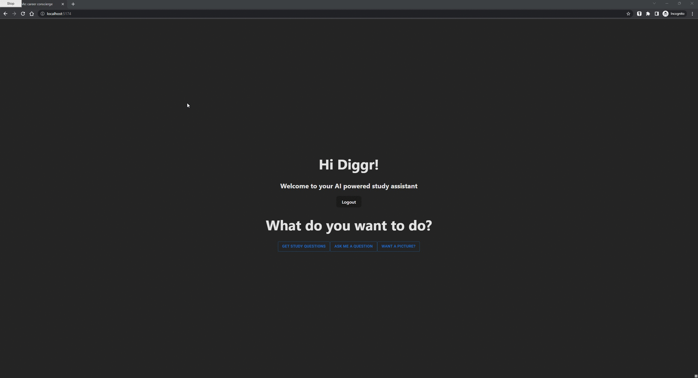
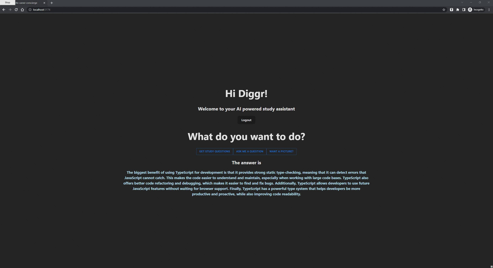

# resYouMe: OpenAI powered study assistant

I'm currently rebuilding the backend of this application in C++ using [drogon](https://www.techempower.com/benchmarks/#section=data-r21) which is currently the fastest web framework in the world

## Multi Factor Authentication (MFA) using Okta

## Questions from quiz API with answers from OpenAI API

## Ask your own questions routed to OpenAI API

## Image generation using OpenAI API

