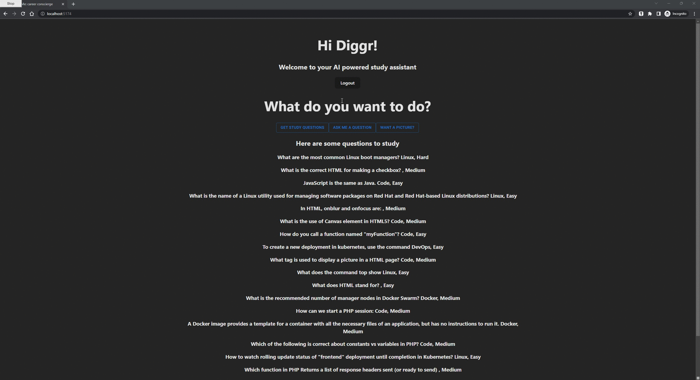

# resYouMe: OpenAI powered study assistant

## Multi Factor Authentication (MFA) using Okta

## Questions from questionAPI with answers from OpenAI API

## Ask your own questions routed to OpenAI API

## Image generation using OpenAI API

